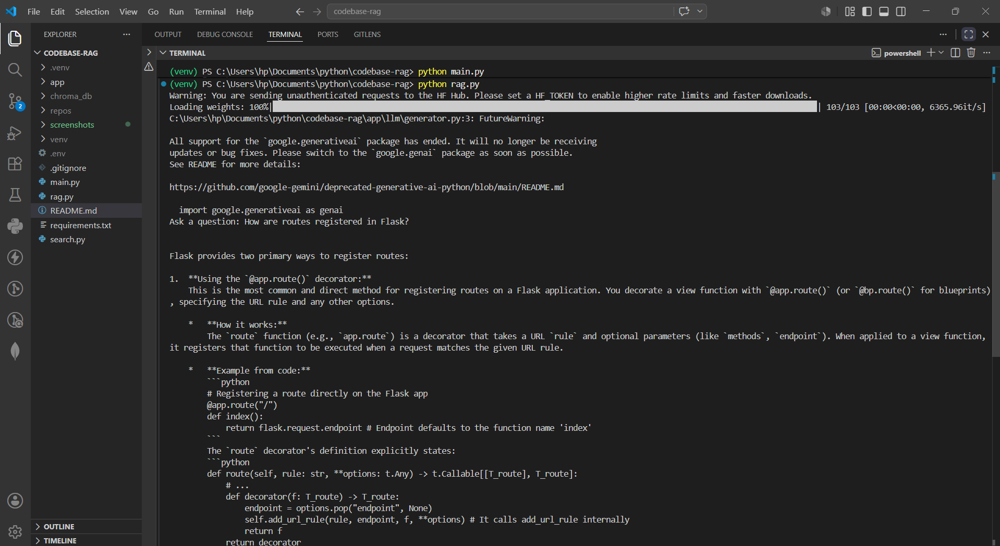

# Codebase RAG Assistant

An AI-powered Retrieval-Augmented Generation (RAG) system that enables users to chat with source code repositories using semantic search and large language models.

## Overview

Codebase RAG Assistant ingests a repository, extracts functions and classes using Python AST parsing, generates semantic embeddings with Sentence Transformers, stores them in ChromaDB, and uses Gemini to answer questions grounded in the actual codebase.

## Features

* Repository ingestion
* AST-based code chunking
* Function and class extraction
* Semantic embeddings using Sentence Transformers
* ChromaDB vector storage
* Semantic code retrieval
* Gemini-powered answer generation

## Screenshots

### Indexing Pipeline

### RAG Question Answering

## Architecture

Repository
↓
Repository Loader
↓
AST Chunker
↓
Sentence Transformer Embeddings
↓
ChromaDB Vector Store
↓
Retriever
↓
Gemini
↓
Answer

## Tech Stack

* Python
* AST
* Sentence Transformers
* ChromaDB
* Google Gemini

## Project Structure

app/
├── ingestion/
├── chunking/
├── embedding/
├── vectorstore/
└── llm/

main.py
rag.py
search.py

## Repository Tested

Flask Framework Repository

* Files Indexed: 83
* Chunks Generated: 1602
* Embedding Size: 384
* Vector Database: ChromaDB

## Example Questions

* How does Flask create an application context?
* How are routes registered in Flask?
* How does Flask handle request dispatching?
* Explain the Flask request lifecycle.
* How does Flask handle exceptions?

## Example Output

Question:

How does Flask create an application context?

Answer:

Flask creates an application context by pushing an AppContext object onto the context stack. This provides access to current_app and application-specific resources during request processing.

## Installation

1. Clone the repository

2. Install dependencies

pip install -r requirements.txt

3. Create a .env file

GEMINI_API_KEY=your_api_key

4. Build the index

python main.py

5. Start the assistant

python rag.py

## Workflow

1. Load repository
2. Parse source code using AST
3. Generate embeddings
4. Store vectors in ChromaDB
5. Retrieve relevant code chunks
6. Generate answers using Gemini